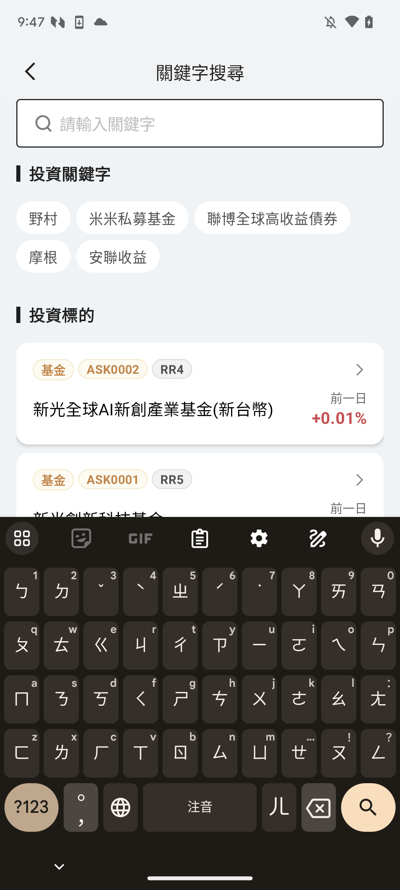
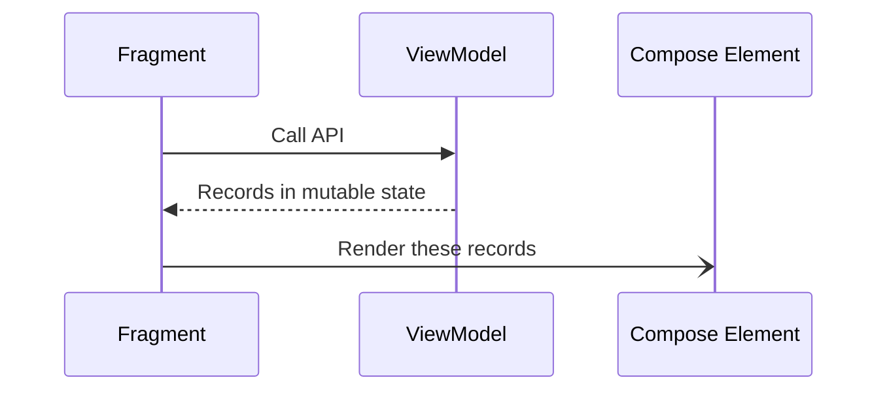
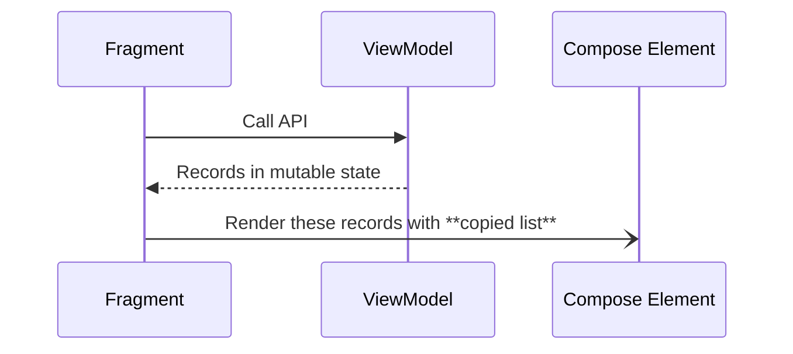

在台灣，某間將來銀行的 Android App 是我寫的。

以上為前情提要。

在某個版本 App 中有一個展示熱門商品列表的頁面，它的行為有：

1. 直接載入前20筆熱門商品，捲到最後幾筆再呼叫 API 載入下一頁
2. 以 LazyColumn 實作整個頁面，含搜尋框
3. 以 stickyHeader 呈現關鍵字，讓它可以在手勢向上的時候收起來
4. 進入頁面時直接跳出鍵盤，方便直接搜尋





Crash 發生在不同手機上稍微不同：在 VIVO X80 上進到頁面後，輸入任何關鍵字在按下鍵盤上的搜尋，便會直接 crash；在其他手機上需要比較複雜的操作：

1. 頁面載入後，輸入關鍵字（先不要按下搜尋）
2. 手勢向上快速滑動的同時，按下搜尋
3. Crash

## 問題分析

從 Crashlytics 上的紀錄看起來是 IndexOutOfBound 造成的

```
Fatal Exception: java.lang.IndexOutOfBoundsException

Index 11 out of bounds for length 0
```

我們的程式是以 MVVM 為主， VM 從 API 得到結果後，透過 mutableState 傳遞給定義在 Fragment 的 Compose 元件，如下所示：



所以在第一次 Compose 拿到 20 筆資料後，並開始 Render 上螢幕的過程中（快速滑動），搜尋新關鍵字的動作會讓整個上述流程再跑一次，只是在另一個 Thread 操作，由那一個 Thread 將新的資料覆蓋到同一個 records 中！

這也就是問題：兩個 thread 有機會同時操作同一個 list：一個 thread 讀取的同時，另一個 thread 去寫！也就是上 crash log 寫的：UI thread 正在嘗試讀取 list 中的第 11 筆並繪製到螢幕上時， background thread 拿著剛拿到的新資料寫進了同一個 list 裡...剛剛要拿東西還有怎麼突然沒有了！

App 只好崩潰給你看...

## 解決方案

重點是保護 list 的讀取/操作，至於要怎麼做？

一開始我用了 CopyOnWriteList，讓每次操作都可以 Copy 一份，可以解決上述的問題。但也產生另一個問題：隨著手勢向上滑載入下一頁，記憶體用量暴增，GC 不斷出現...有這個不友善的行為，決定不採用。

由於是兩個 thread 讀取同一個 list，所以模仿 CopyOnWriteList，是不是只要在 Compose 元件從新的 MutableState 裡拿到新的 list 時，從另一個複製出來的 list 去繪製資料就可以了呢？



這個方式測試後也可以解決問題，記憶體也沒有像使用 CopyOnWriteList 一樣大幅度增加，GC 也就不會出現！

要注意到因為是 list 的複製，所以要自行處理 deep copy 的行為。如果你的 data class 有很多層，記得不能僅用 data class 提供的 copy function，因為它只會複製第一層的欄位，再往下一層去就只是 reference 的複製而已，又稱為 shallow copy（詳細可參考 [[Copy function of Data class]]）

這樣還是有機會讓兩個 thread 處不好喔！

## 最終解法

自行實作一個 deepCopy function 讓 fragment 在轉手傳遞 list 到 Compose 元件時使用：

```kotlin
WMSProductSearchScreen(  
    searchResult = viewModel.searchResult?.deepCopy()  
        ?: NCBGenericProductResult(_state = GeneralState.NoData),  
    productClicked = { code -> redirect(XYZ) },  
    onScrollToEnd = {  
        viewModel.searchProduct(keyword = it, isSearchNewKeyword = false)
    },  
    refreshClicked = {  
        viewModel.searchProduct(keyword = it, isSearchNewKeyword = true)  
    }
)
```

特別是 list 的複製：

```kotlin
fun GenericProductInfo.deepCopy() =  
    GenericProductInfo(  
        products = mutableListOf<GenericProduct>().also { it.addAll(products) },  
        pageInfo = pageInfo?.copy()  
    )
```

## 結語

儘管上面寫了技術解法，在 UI 設計上其實也是有解法：

1. 進入頁面時不要讓鍵盤預設出現，讓使用者專心滑產品（搜尋降為第二步的操作）
2. 或者，進入頁面時還是讓鍵盤預設出現，加上像 iOS 一樣在整個畫面加上一層擷取觸擊的元件（輸入框以外），只要一觸擊到這層元件就將鍵盤關閉，減少兩個元件互相干擾的流程


技術解法外，改變規格的做法都可以考慮看看。

當然，這要看你 Bargin 能力有多強囉！